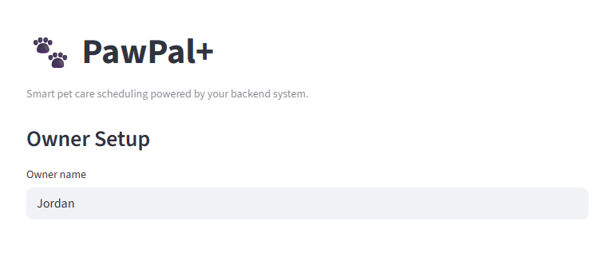
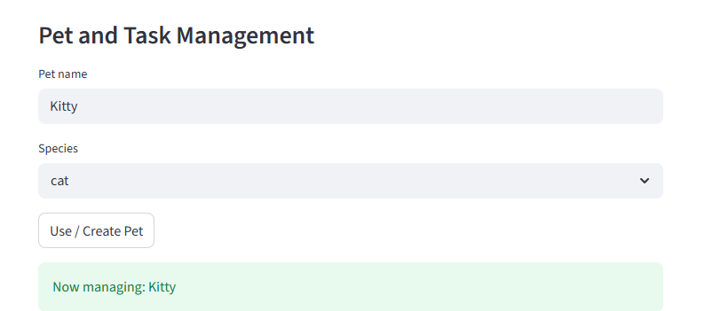
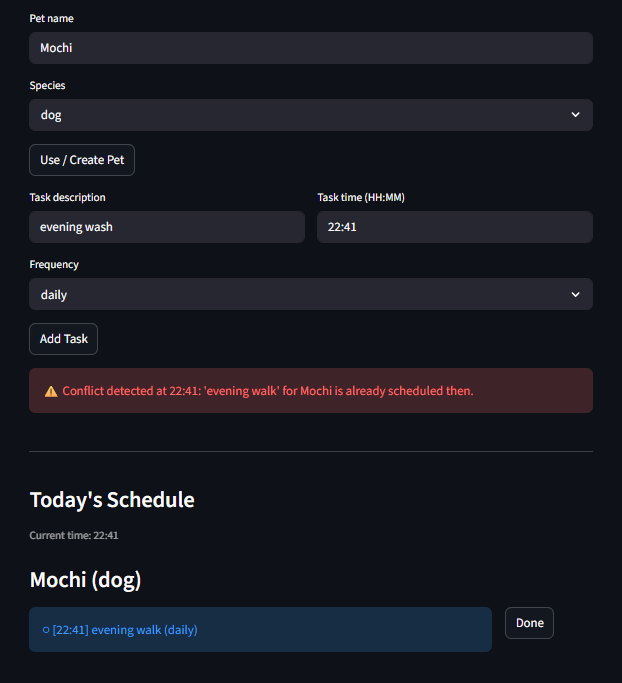

# PawPal+ (Module 2 Project)

PawPal+ is a Streamlit app that helps pet owners organize daily care tasks with a clear schedule and actionable warnings.

## Features

- Task sorting by time (`HH:MM`) for a clean chronological plan.
- Filtering by pet and completion status for focused task views.
- Conflict detection for same-time tasks with readable warnings.
- Recurring task handling for daily and weekly task continuity.
- Clean terminal and UI output for easier review and debugging.

## Demo

### 1. User Setup



This screen shows owner setup, where the user name is entered and stored for the current session.

### 2. Pet Management



This section lets you create or switch the active pet, so tasks are assigned to the correct pet profile.

### 3. Task Scheduling



This view shows task creation with time and frequency, plus schedule rendering with overdue and conflict feedback.

## Usage

Install dependencies:

```bash
python -m venv .venv
source .venv/bin/activate  # Windows: .venv\Scripts\activate
pip install -r requirements.txt
```

Run the app:

```bash
streamlit run app.py
```

Run tests:

```bash
python -m pytest
```

## Testing

The test suite validates core scheduler correctness, including sorting, filtering, recurring task creation, and conflict detection.
These checks matter because they protect critical planning behavior and reduce regressions as the system evolves.
